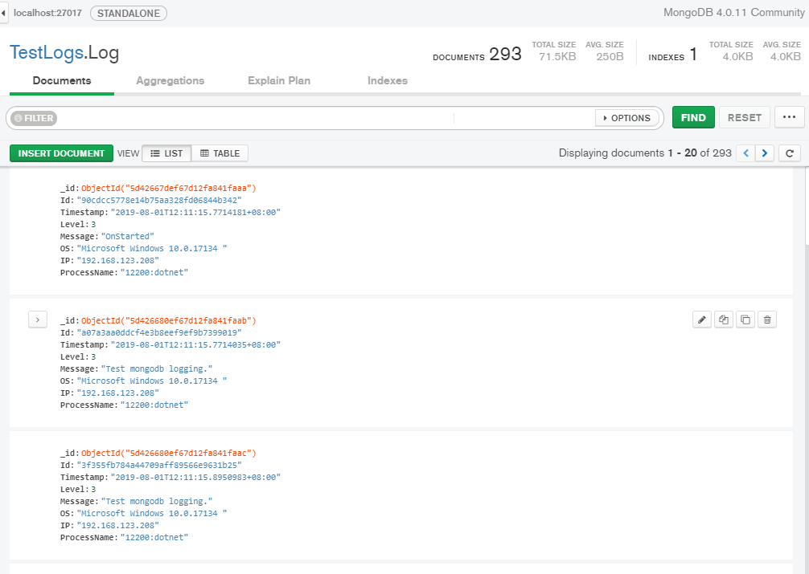

# MongoDB.Logging
MongoDB provider for Microsoft's logging for .NET Core class libaries and console applications

### 1.add config
``` csharp
log.AddConsole(); //Add Console Logging
log.AddMongoDB((option) =>{ //Add MongoDB Logging
    var settings =  config.GetSection("Logging").GetSection("MongoDB");
    option.Connstr =  settings["Conn"];//connection string
    option.Database = settings["Database"];//database's name
    option.Collection = settings["Collection"];//collection's name
});
```
### 2.usage
``` csharp
 _logger.LogWarning("start mongodb logging.");
```
### 3.test
 
